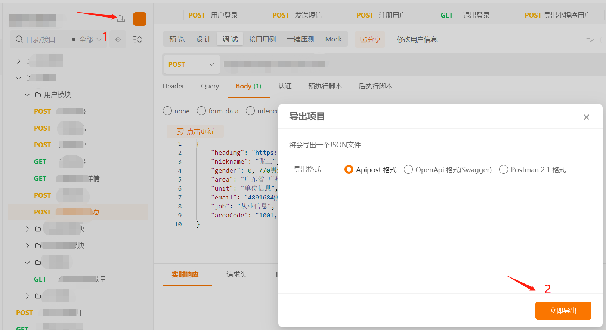

# apipost-api-generator

根据 apipost 导出的接口数据生成前端接口

## 使用

安装依赖

```sh
npm i -D apipost-api-generator
# or
pnpm i -D apipost-api-generator
```

在根目录下添加 `apipost.config.js` 文件：

```js
module.exports = {
    // apipost 接口数据文件
    entry: './apipost.json',
    // 文件生成时自动添加头部的代码
    fileHeader: "import request from '@/utils/request'\n\n",
    // 文件生成时自动添加底部的代码
    fileFooter: '',
    // 每次生成 api 代码时触发，参数是生成的 api 代码，可以通过 loader 二次处理后将代码返回
    // apiLoader(code) {
    //     return code
    // },
    // 文件名映射，示例：{ '文件上传': 'upload' }，生成的文件名是根据 apipost 中配置的名称生成的
    // 如果这个文件名不是你想要的，可以通过这个配置进行转换
    fileNameMap: {
        文件上传: 'upload',
    },
    // api 文件输出目录 default: api-post-files
    output: '',
    // 输出目录前是否要清空目录 default: true
    clear: true,
    // 'api' | 'dto'，api 生成前端接口 文件，dto 生成 nestjs dto 文件
    type: 'api',
}

```

添加配置文件后，在 `package.json` 中添加命令：

```json
"scripts": {
    "apigen": "apipost-api-generator --config apipost.config.js"
}
```

将 apipost 中的项目导出为 json 文件，放到根目录下，如下图所示：



然后执行命令 `pnpm apigen` 或者 `npm run apigen`，即可生成相关的接口文件。
## 示例
```json
{
	"project": {},
	"apis": [
		{
			"target_type": "api",
			"name": "查询项目详情",
			"mark": "developing",
			"sort": 3,
			"tags": [],
			"method": "GET",
			"mock": "{}",
			"mock_url": "/assembly/projects/:id",
			"request": {
				"url": "/assembly/projects/:id",
				"description": "",
				"event": {
					"pre_script": "",
					"test": ""
				},
				"resful": {
					"parameter": [
						{
							"key": "id",
							"description": "",
							"is_checked": 1,
							"type": "Text",
							"not_null": 1,
							"field_type": "String",
							"value": "7016331547402190848"
						}
					]
				}
			},
			"response": {
				"success": {
					"raw": "",
					"parameter": [],
					"expect": {
						"name": "成功",
						"isDefault": 1,
						"code": 200,
						"contentType": "json",
						"verifyType": "mock",
						"mock": "{\r\n    \"name\":\"项目名称\",\r\n    \"id\":\"主键id\",\r\n    \"config\":{\r\n        \"dataSource\":{\r\n            \"api\":[]\r\n        },\r\n        \"variables\":{}\r\n    }\r\n}",
						"schema": []
					}
				},
				"error": {
					"raw": "",
					"parameter": [],
					"expect": {
						"name": "失败",
						"isDefault": -1,
						"code": 404,
						"contentType": "json",
						"verifyType": "schema",
						"mock": "",
						"schema": []
					}
				}
			},
			"children": []
		}
	],
	"envs": [],
	"models": []
}
```
经过处理后：
```ts
export interface GETAssemblyProjectsIdResponse {
    name: string
    id: string
    config: Record<string, any>
}

/**
 * 查询项目详情
 */
export function getAssemblyProjectsId(id: string): Promise<GETAssemblyProjectsIdResponse> {
    return request({
        url: `/assembly/projects/${id}`,
        method: 'GET',
    })
}
```
